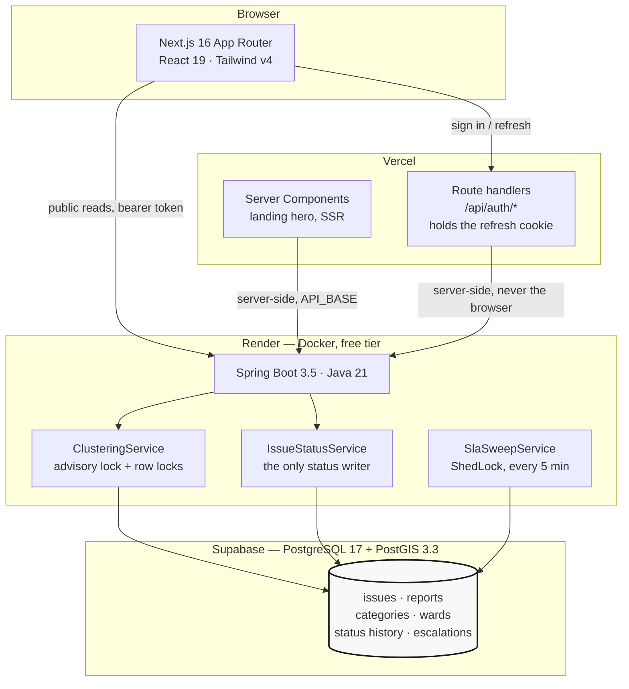
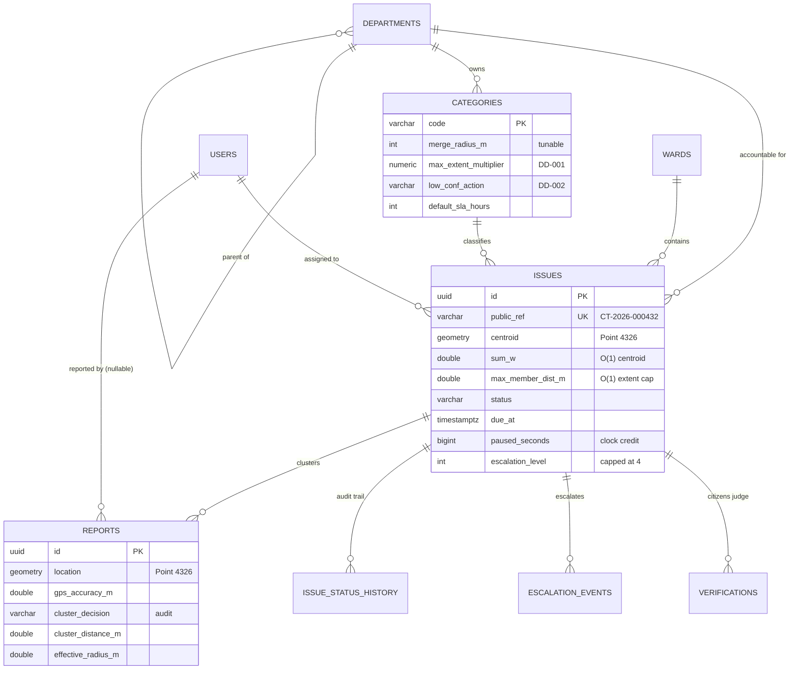
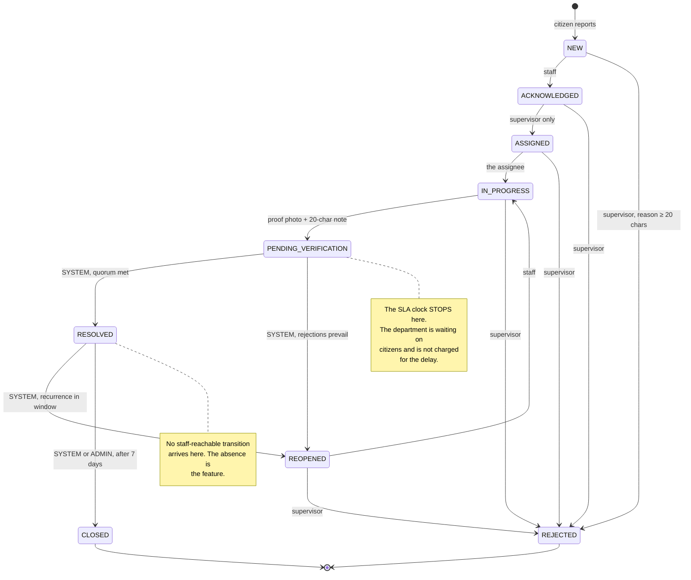
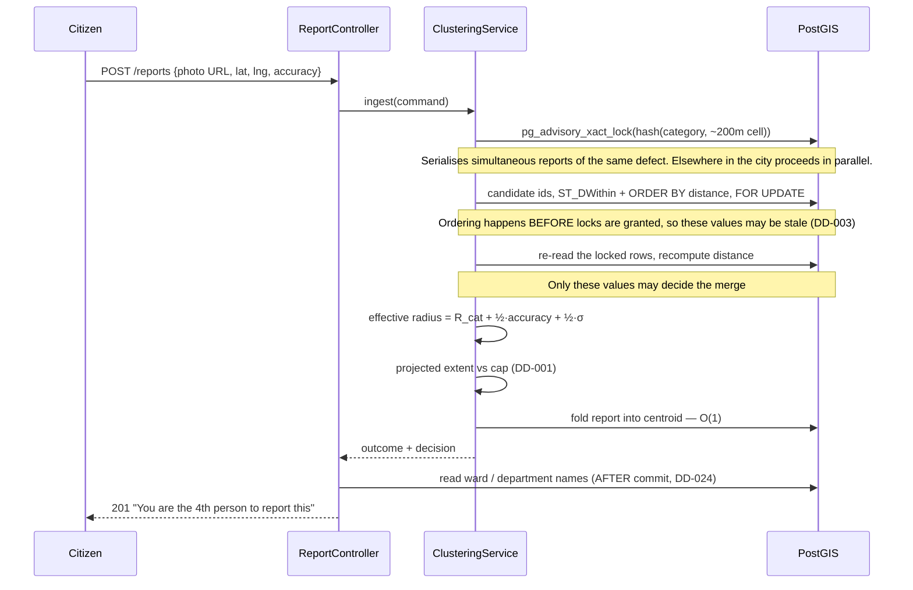
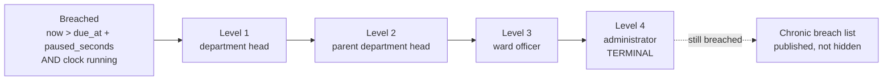
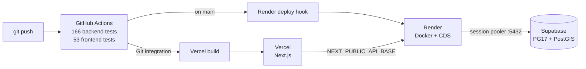

# CivicTrack — architecture

Diagrams are Mermaid, so they render on GitHub and export to vector for the
report. Each one is followed by the reasoning it encodes; a diagram without the
argument behind it is decoration.

Companion documents: `DESIGN-DECISIONS.md` for the forty decisions this system
made and why, `civictrack-app-blueprint.md` for the screen and API contract,
`civictrack-java-blueprint.md` for the backend specification.

---

## 1. Components

**Why the auth split.** The access token lives in React state and dies with the
tab. The refresh token never reaches JavaScript at all: Vercel route handlers
put it in an httpOnly cookie and exchange it server-side. That is the whole
reason those handlers exist rather than the browser calling Spring directly —
a thirty-day refresh token in `localStorage` is a thirty-day account takeover
for anything that can inject a script (DD in blueprint §6).

**Why the landing page is a Server Component.** Its hero is the live overdue
count, and it must be in the initial HTML — a number that arrives after
hydration makes no claim to a slow connection, a link preview, or a crawler.

**Why the session pooler.** Supabase's direct host is IPv6-only and Render's
free tier has no IPv6 egress. Session mode on port 5432 keeps one backend per
client session, so prepared statements and advisory locks behave as they would
on a direct connection. Transaction mode (6543) does not (DD-040).

---

## 2. Data model

**Why `sum_w`, `sum_wx`, `sum_wy` are columns.** They make the
accuracy-weighted centroid an O(1) update per arriving report instead of a
rescan of every member. `max_member_dist_m` extends the same principle to the
extent cap: one column, one comparison. Without them, ingest cost grows with
cluster size, which is exactly the wrong direction for a system whose selling
point is that reports accumulate.

**Why every tunable is a column on `categories`.** Standing rule 1. Changing a
merge radius is an `UPDATE`, not a redeploy, and "how did you choose 25 m?" has
an answer that is configuration with a rationale rather than a constant
compiled into a service.

**Why `paused_seconds` rather than rewriting `due_at`.** `due_at` answers "when
was this due, measured from the report", and the pause credit stays a separate,
visible number. Rewriting the deadline on every pause would make the two
indistinguishable in the audit trail.

---

## 3. The issue lifecycle

**The claim this diagram makes.** There is no edge from any staff-reachable
state to `RESOLVED` or `CLOSED`. Staff reach `PENDING_VERIFICATION` and stop;
the system resolves after citizens weigh in, and an administrator or the
auto-close job closes. That is the project's accountability argument expressed
as a missing table row, and it is enforced in three places that fail loudly:
`TransitionPolicy` refuses to construct if the table ever violates it,
`TransitionPolicyTest` attempts a STAFF move to RESOLVED from all nine states
and requires all nine to be refused, and the work view renders no such action
(DD-035).

**Why `ACKNOWLEDGED` has no direct edge to `IN_PROGRESS`.** Work starts when
somebody owns it. Assignment is a supervisor's decision, so an acknowledged
issue waits — and the staff work view says exactly that rather than offering a
button the server would refuse.

---

## 4. What happens when a report arrives

**Why two phases for the candidate lookup.** PostgreSQL evaluates `ORDER BY`
and `LIMIT` before acquiring row locks, so any distance computed by the first
query may be stale by the time the lock is granted. The first query returns
ids only — deliberately, so nothing invites a caller to trust its distances —
and the second re-reads under the lock. The band decision uses only what comes
back from the second (DD-003).

**Why the display names are read after commit.** That transaction holds an
advisory lock and row locks on candidate issues. Three joins to fetch strings
for a screen would lengthen the one critical section the whole design exists to
manage (DD-024).

---

## 5. Escalation

**Why level 3 leaves the department tree.** A ward officer is accountable for a
place, not a service. The ladder walks the org chart for two rungs, then hands
the issue to somebody accountable across departmental lines (DD-005).

**Why the cap is terminal.** Capping at 4 stops the number climbing forever,
but capped issues do not stop being visible — they feed the chronic-breach
list. Hiding them would be the failure this system exists to make impossible.

**Three layers of idempotency**, because the sweep may run twice, on two
instances, concurrently: `FOR UPDATE SKIP LOCKED` so workers take disjoint
slices, a unique constraint on the escalation event, and a compare-and-swap on
`escalation_level` that returns zero rows if somebody else moved first.

---

## 6. Deployment

**Why the image trains a CDS archive at build time.** Render's free tier spins
down after 15 minutes idle, and an uninstrumented Spring Boot cold start is
20–40 seconds — long enough to lose a room. Class Data Sharing pre-parses class
metadata into a memory-mappable archive; measured startup is **3.5 seconds**.
The build stage asserts the archive loads with `-Xshare:on`, turning a silent
fallback into a failed build, because the failure mode is otherwise invisible:
the container boots fine and simply costs 20 seconds nobody attributes.

**Why CI runs `mvn clean`, not an incremental build.** A stale `target/` served
old compiled SQL during phase 4 and produced two confidently wrong diagnoses of
a query that was correct all along (DD-027).
